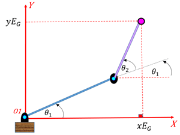
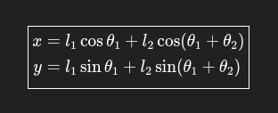
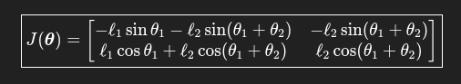
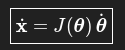
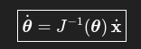
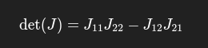
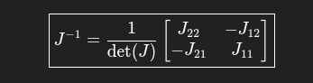

# Kinematics Arm Planar

Pada simulasi code ini, arm menggunakan 2 link dan 2 joint. Perbedaan link dan joint adalah, link adalah lengan dan joint adalah sendi yang bisa berputar. Untuk simulasi lanjutan bisa menggunakan python atau urdf langsung. Sebelum mempelajari kinematik, sebaiknya mempelajari dasar dasar turunan, integral, kinematika, dan dinamika partikel pada mata kuliah Fisika dan kalkulus. 

<p align="center">
  
  <p align = "center" >
      <i>Gambar Arm dengan 2 link dan 2 joint</i>
  </p>
</p>

Titik merah merupakan End-Effector, titik biru merupakan joint, dan garis berwarna biru dan ungu merupakan link. Kemudian kemiringan link 1 direpresentasikan pada sudut theta 1 sementara link 2 direpresentasikan pada sudut theta 1 + theta 2.


## Forward Kinematics
Untuk menentukan posisi ujung robot jika sudut joint diketahui

<p align="center">
  
</p>

## Jacobian Robot 2 Link Planar
Untuk menerjemahkan kecepatan linear pada end effector 

<p align="center">
  
</p>

## Kecepatan Linear End-Effector
Menentukan kecepatan gerak ujung robot akibat kecepatan sudut joint

<p align="center">
  
</p>

## Kecepatan Sudut Joint
Menentukan kecepatan sudut joint jika kecepatan linear ujung robot diketahui

<p align="center">
  
</p>

Perlu ditentukan terlebih dahulu apakah Jacobian bisa diinvers atau tidak dengan syarat **Det(J) != 0**. 

<p align="center">
  
</p>

Jika Deterimnannya adalah 0 maka tidak bisa diinvers. Jika Determinannya bukan 0 maka dilanjutkan ke rumus berikut:

<p align="center">
  
</p>

# Compile & Run 
```bash
g++ exc_1.cpp -o exc_1.exe
./exc_1.exe
```

## Penjelasan Output
Berikut merupakan contoh output pada program menghitung kecepatan linear
```bash
1. hitung kecepatan linear
2. hitung kecepatan sudut
3. Kontrol Resolved Rate
Select option: 1
l1: 1
l2: 2
theta1: 30
theta2: 60
thetaDot1 (rad/s): 1
thetaDot2 (rad/s): 1
xdot = -4.5 m/s
ydot = 0.866025 m/s
```

Pada program tersebut, artinya adalah panjang lengan 1 adalah 1 meter, dan panjang lengan 2 adalah 2 meter. kemudian sudut theta 1 adalah 30 derajat, dan sudut theta 2 adalah 60  derajat. Kecepatan sudut pada theta 1 adalah 1 rad/s dan pada theta 2 adalah 1 rad/s. Yang dihasilkan dari program tersebut adalah kecepatan linear dari end-effector sebesar 4.5 m/s ke kiri dan 0.866 m/s ke atas. 


